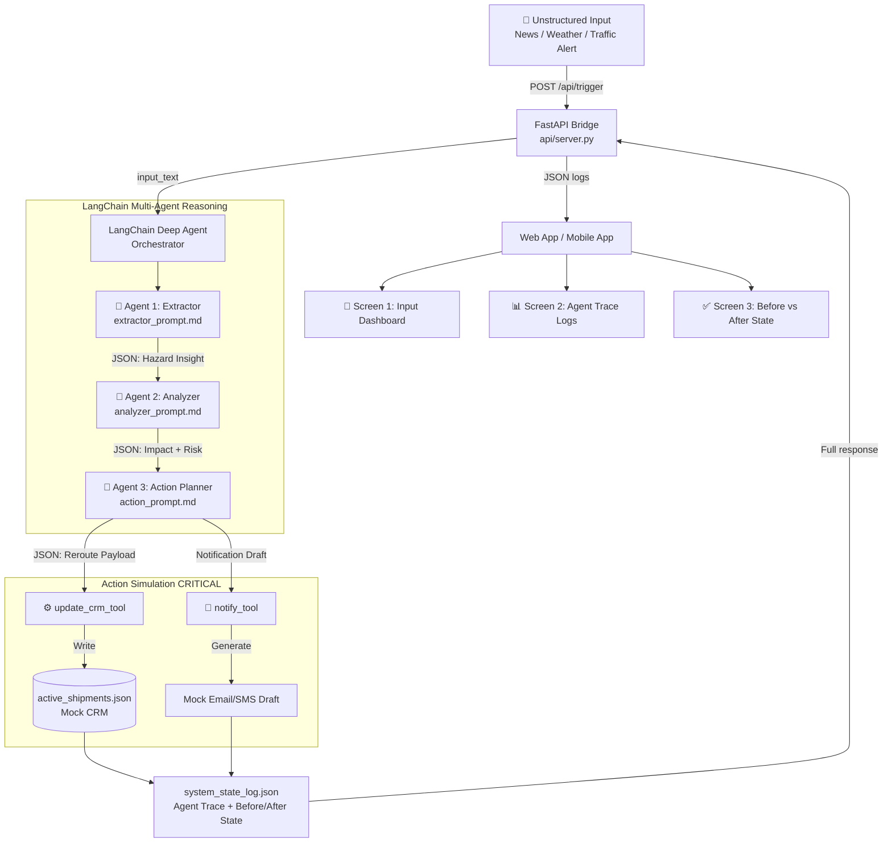

# 🚑 BioRoute Cold-Chain — Project Scope & BRD
> **Hackathon:** Antigravity: The Content-to-Action Agent Design Framework  
> **Timeline:** 24-Hour Sprint  
> **Last Updated:** 2026-05-16

---

## 📋 Executive Summary

The **BioRoute Cold-Chain Agent** is an autonomous, agentic AI system designed to monitor unstructured environmental data (news, weather, traffic) and proactively protect temperature-sensitive medical logistics.

Moving beyond simple summarization, the system will:
1. **Ingest** unstructured alerts (news, weather, traffic)
2. **Extract** operational hazards (not generic summaries)
3. **Predict** the impact on active supply chains
4. **Execute** database reroutes and stakeholder notifications autonomously

---

## 🎯 Domain & Use Case

- **Domain:** Logistics / Supply Chain + News Analysis
- **Business:** BioRoute Cold-Chain — A specialized logistics company transporting temperature-sensitive medical supplies (vaccines, organs, insulin) between regional hubs and hospitals
- **Core Problem:** Real-time environmental threats (heatwaves, traffic, storms) can spoil medical cargo worth $50,000+ and cause critical hospital shortages

---

## 🏗️ Technology Stack

| Layer | Technology | Role |
|-------|-----------|------|
| **IDE** | Google Antigravity | Development environment only (NOT part of final product) |
| **Agent Framework** | LangChain Deep Agents (`deepagents`) | Core orchestration of multi-agent workflow |
| **LLM** | Gemini / Anthropic / OpenAI | LLM backend for reasoning |
| **Backend API** | FastAPI (Python) | REST API bridge between frontend and agent |
| **Database (Mock CRM)** | Local `active_shipments.json` | Simulates CRM/database for action simulation |
| **Frontend (Phase 1)** | Simple Web App | Test and demo the pipeline |
| **Frontend (Phase 2)** | Flutter Mobile App | Mandatory deliverable |

> ⚠️ **IMPORTANT (Supervisor Clarification):** Google Antigravity is used **ONLY as the IDE** (development environment). The final product must NOT depend on Antigravity to run. We code the agents ourselves using LangChain Deep Agents.

---

## 🔄 End-to-End Flow (The 6-Step Pipeline)

```
INPUT (Unstructured News/Alert)
    ↓
STEP 1: Insight Extraction
    → Extract: Location, Hazard Type, Severity
    → NOT a summary — structured JSON facts only
    ↓
STEP 2: Impact Analysis
    → Cross-reference hazard with active shipments database
    → Calculate time-to-failure, financial loss
    → e.g., "SHP-882 cooling unit fails in 45 mins → $50,000 loss"
    ↓
STEP 3: Action Generation
    → Recommend domain-relevant rescue plan
    → e.g., "Reroute SHP-882 to District 3 Backup Facility"
    ↓
STEP 4: Action Simulation ⚡ CRITICAL REQUIREMENT
    → Simulation 1: Update active_shipments.json (mock CRM update)
    → Simulation 2: Generate automated Email/SMS draft to hospital
    ↓
STEP 5: State Logging
    → Write system_state_log.json with all agent traces
    ↓
STEP 6: Outcome Visualization (Mobile/Web App)
    → Show BEFORE state: "Highway 9 → In Transit (On Time)"
    → Show AFTER state:  "District 3 → Emergency Reroute"
    → Display Agent Trace logs
```

---

## 🤖 Agent Architecture (LangChain Deep Agents)

### Agent 1: Context Extractor Agent
- **Role:** Content Understanding & Insight Extraction
- **Input:** Raw unstructured text (news/weather alert)
- **Output:**
```json
{
  "hazard_detected": true,
  "location": "District 4",
  "hazard_type": "Traffic block + 42°C heatwave",
  "severity_details": "Highway 9 blocked, high risk of spoilage in 45 mins"
}
```

### Agent 2: Impact Analyzer Agent
- **Role:** Impact Analysis
- **Input:** Extracted hazard JSON + `business_context.md` + `active_shipments.json`
- **Output:**
```json
{
  "impact_detected": true,
  "affected_shipment_id": "SHP-882",
  "operational_impact": "Truck stuck in 42°C heat, cooling unit failure in 45 mins",
  "financial_consequence": "$50,000 cargo spoilage + critical medical shortage"
}
```

### Agent 3: Action Planner Agent
- **Role:** Action Generation + Simulation Formatting
- **Input:** Impact analysis JSON
- **Output:**
```json
{
  "recommended_action": "Reroute shipment to backup facility to prevent spoilage",
  "database_simulation_payload": {
    "shipment_id": "SHP-882",
    "new_status": "Emergency Reroute",
    "new_destination": "District 3 Cold-Vault"
  },
  "notification_simulation": {
    "recipient": "District 4 General Hospital Administration",
    "message_draft": "URGENT: Shipment SHP-882 (Insulin) has been rerouted to District 3 Cold-Vault due to heatwave + traffic block on Highway 9. New ETA pending."
  }
}
```

### Orchestrator (LangChain/LangGraph)
- **Role:** Master Controller & Workflow Manager
- Manages sequential execution of all 3 agents
- Handles rate limit retries (exponential backoff: 5s → 10s → 15s, max 3 retries)
- Writes to `system_state_log.json` after each step
- Triggers action simulation tools
- Returns final state to frontend

---

## 📁 Project File Structure

```
hackathone/
├── PROJECT_SCOPE.md              ← This file
├── pyproject.toml
├── .python-version
├── active_shipments.json         ← Mock CRM database (BEFORE state)
├── system_state_log.json         ← Agent trace log (written at runtime)
├── langchain_agent/
│   ├── __init__.py
│   ├── main.py                   ← Main LangChain Deep Agent orchestrator
│   ├── agent.py                  ← create_deep_agent setup
│   ├── tools.py                  ← Custom tools (update_crm_tool, notify_tool)
│   ├── prompts/
│   │   ├── business_context.md   ← Business rules & constraints
│   │   ├── extractor_prompt.md   ← Agent 1 system prompt
│   │   ├── analyzer_prompt.md    ← Agent 2 system prompt
│   │   └── action_prompt.md      ← Agent 3 system prompt
│   └── api/
│       └── server.py             ← FastAPI bridge (POST /api/trigger)
├── webapp/                       ← Phase 1: Simple web frontend
└── README.md
```

---

## 📄 Key Files Content

### `active_shipments.json` (Mock CRM — BEFORE state)
```json
{
  "last_updated": "2026-05-16T16:00:00Z",
  "active_shipments": [
    {
      "shipment_id": "SHP-882",
      "cargo_type": "Insulin (Temp Critical)",
      "max_idling_temp_threshold_celsius": 38,
      "destination": "District 4 General Hospital",
      "primary_route": "Highway 9",
      "current_status": "In Transit (On Time)",
      "backup_facility": "District 3 Cold-Vault"
    },
    {
      "shipment_id": "SHP-901",
      "cargo_type": "Saline IVs",
      "max_idling_temp_threshold_celsius": 50,
      "destination": "District 1 Clinic",
      "primary_route": "Route 66",
      "current_status": "In Transit (On Time)",
      "backup_facility": "District 1 Hub"
    }
  ]
}
```

### `system_state_log.json` (Written at runtime by Orchestrator)
```json
{
  "session_id": "REQ-1092",
  "status": "in_progress",
  "step_1_input": "Severe heatwave alert issued for District 4...",
  "step_2_extraction": { "...": "filled by Extractor Agent" },
  "step_3_analysis":   { "...": "filled by Analyzer Agent" },
  "step_4_action_plan":{ "...": "filled by Action Planner Agent" },
  "step_5_execution_result": { "...": "filled by Orchestrator after tool execution" }
}
```

---

## 🧠 Business Context Rules (for Agent Grounding)

| Rule | Value |
|------|-------|
| Max safe idle time (temp > 38°C) | **45 minutes** |
| Cargo spoilage cost | **$50,000** per shipment |
| Rerouting trigger | Blocked route + temp > 38°C + idling |
| Notification policy | Immediate email/SMS to destination hospital |

---

## 🔁 Retry & Error Handling Strategy

```
On API rate limit (429) or timeout:
  → Wait 5 seconds, retry
  → If fails again: wait 10 seconds, retry
  → If fails again: wait 15 seconds, retry
  → After 3 retries: log failure to system_state_log.json
    { "status": "failed_at_step_2_analysis", "error": "..." }
  → Return partial logs to frontend
```

---

## 🏗️ Architecture Flow Diagram (Mermaid)



---

## 📱 Mobile App Screens (3 Required Screens)

### Screen 1: Ingestion Dashboard
- Header: "BioRoute Cold-Chain"
- Active Shipments overview card: "2 Active Medical Shipments"
- Large text input: "Ingest Unstructured Alert"
- CTA Button: "Analyze & Protect Supply Chain"

### Screen 2: Agentic Workflow & Trace Logs
- **Timeline stepper** showing agent reasoning:
  - ✅ Step 1 — Insight: "Traffic + 42°C heatwave in District 4"
  - ⚠️ Step 2 — Impact: "SHP-882 cooling fails in 45 mins, $50K loss"
  - 🔄 Step 3 — Action: "Reroute to District 3 Backup Facility"
  - ⚙️ Step 4 — Executing: "CRM update + Email draft..."

### Screen 3: Outcome Visualization
- Toggle: **"Before Alert"** / **"After AI Execution"**
- Before: SHP-882 → Highway 9 → "In Transit (On Time)" 🟢
- After: SHP-882 → District 3 Cold-Vault → "Emergency Reroute" 🔴
- Simulation Logs: "Automated Alert Sent to Hospital Admin: ..."
- Acknowledge button

---

## ✅ Deliverables Checklist

- [ ] `active_shipments.json` — Mock CRM database
- [ ] `langchain_agent/` — Complete LangChain Deep Agents backend
- [ ] `api/server.py` — FastAPI bridge (POST /api/trigger)
- [ ] `system_state_log.json` — Agent trace logs (generated at runtime)
- [ ] Web App (Phase 1) — Simple frontend showing before/after
- [ ] Mobile App (Phase 2) — Flutter app (MANDATORY)
- [ ] README.md — Architecture docs + Antigravity usage proof
- [ ] Demo Video (3-5 mins) — Input → Action → Result pipeline
- [ ] Agent Trace Logs export — Copied from Antigravity terminal

---

## 📊 Grading Rubric Alignment

| Criteria | Points | How We Hit It |
|----------|--------|---------------|
| Insight Extraction | — | Extractor Agent: structured JSON hazard facts, NOT summaries |
| Impact Analysis | — | Analyzer Agent: connects hazard to $50K spoilage prediction |
| Action Generation | — | Action Planner: domain-relevant reroute recommendation |
| **Action Simulation** | **CRITICAL** | `update_crm_tool` physically writes to `active_shipments.json` |
| Outcome Visualization | — | Before/After state in mobile app |
| Multi-step Reasoning | — | 3 sequential LangChain agents with state passing |
| **Google Antigravity** | **25%** | Used as IDE; terminal logs exported as Agent Trace |
| Traceable Decision-Making | — | `system_state_log.json` + app logs screen |
| Robustness / Edge Cases | — | Retry logic with exponential backoff |
| Mobile App | **MANDATORY** | Flutter app (Phase 2) |

---

## 🚀 Build Order (24-Hour Sprint)

| Hour | Task | Status |
|------|------|--------|
| 0-1 | Set up project structure + `active_shipments.json` | ✅ Done |
| 1-2 | FastAPI bridge + POST /api/trigger endpoint | ✅ Done (api_server.py) |
| 2-4 | LangChain Deep Agent setup + Extractor Agent | 🔜 Next |
| 4-6 | Analyzer + Action Planner agents + tool binding | 🔜 |
| 6-8 | `update_crm_tool` + `notify_tool` + full pipeline test | 🔜 |
| 8-10 | `system_state_log.json` output + retry logic | 🔜 |
| 10-14 | Simple Web App frontend (before/after visualization) | 🔜 |
| 14-20 | Flutter mobile app (3 screens) | 🔜 |
| 20-23 | README + demo video recording | 🔜 |
| 23-24 | Final review + submission | 🔜 |

---

## 📝 Test Scenario (The Demo Input)

```
"Severe heatwave alert issued for District 4. 
Temperatures expected to spike to 42°C in the next hour. 
Additionally, a multi-car accident has completely blocked Highway 9."
```

**Expected outcome after agent runs:**
- `active_shipments.json` → SHP-882 status changes from `"In Transit (On Time)"` → `"Emergency Reroute"`, destination → `"District 3 Cold-Vault"`
- Notification draft generated for District 4 General Hospital
- Full agent trace logged to `system_state_log.json`
