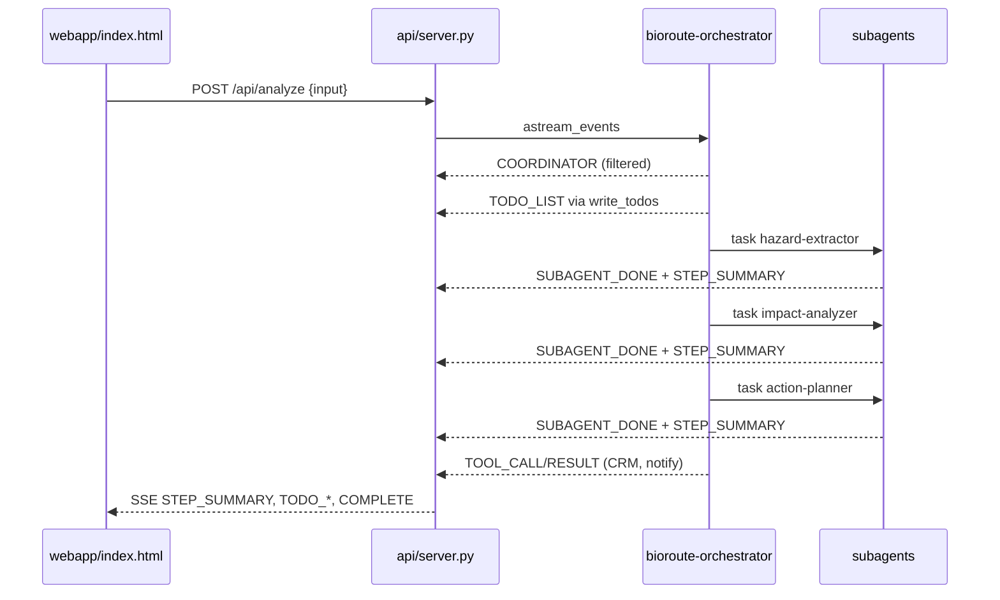
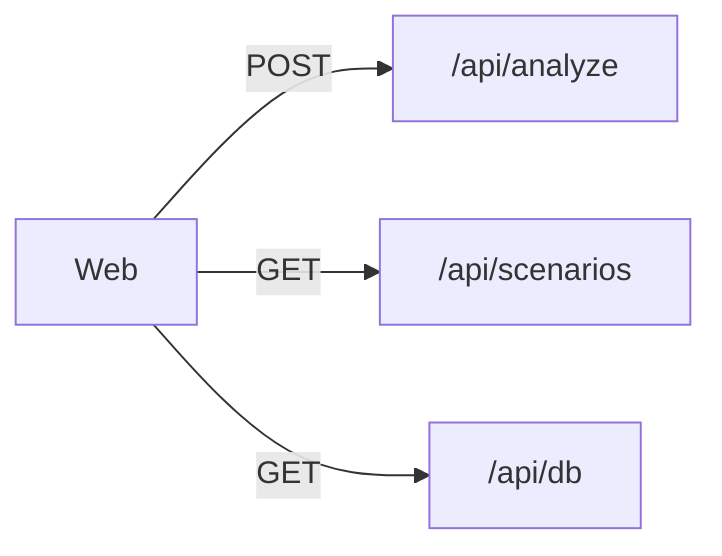
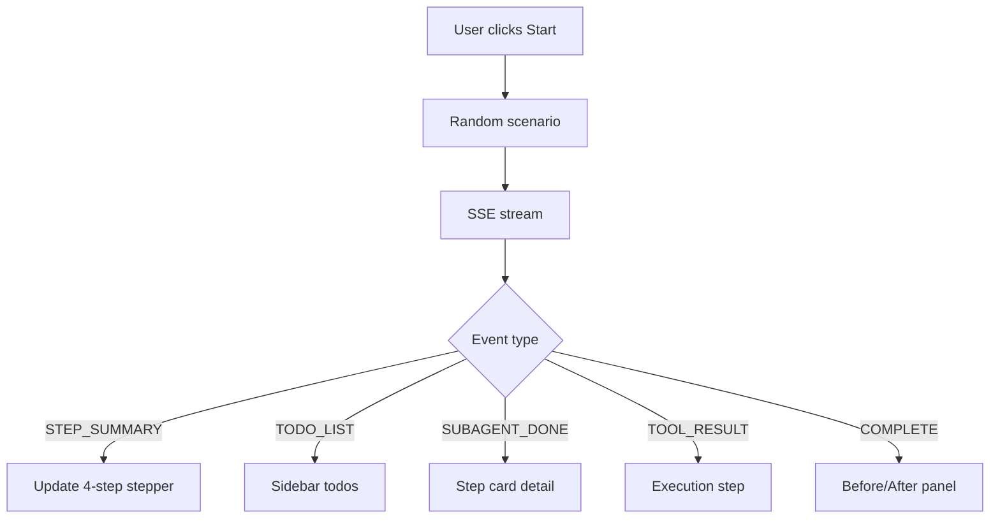

# Task: Judge-friendly agent outputs (web UI only)

## Goal
Make agent pipeline outputs understandable for hackathon judges: short step summaries, filtered SSE stream, sidebar todo list, no raw JSON/file dumps. Mobile UI unchanged.

## Requirements
- Align Pydantic schemas with PROJECT_SCOPE fields + `display_summary` per subagent
- Rewrite orchestrator/subagent prompts: brief narration, no file echo, clear reroute rules
- Server: filter noisy SSE events; emit `STEP_SUMMARY`, `TODO_LIST`, `TODO_UPDATE`
- Web UI: 4-step pipeline stepper, enhanced streaming, todo sidebar from dedicated events

## Flow (Mermaid)

### Sequence

### Per-route map

### End-to-end

## Acceptance Criteria
- [ ] No full `active_shipments.json` or `business_context.md` in web trace
- [ ] Each subagent shows one `display_summary` line on stepper
- [ ] Todo list appears in sidebar from `TODO_LIST` events
- [ ] Orchestrator emits ≤4 short reasoning lines (server filters duplicates/long text)
- [ ] Mobile files untouched

## Files to Change
- `langchain_agent/schemas.py`
- `langchain_agent/agent.py`
- `langchain_agent/api/server.py`
- `webapp/index.html`
