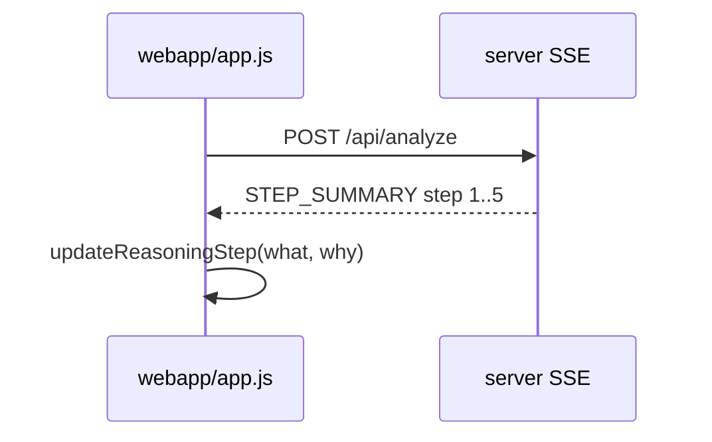
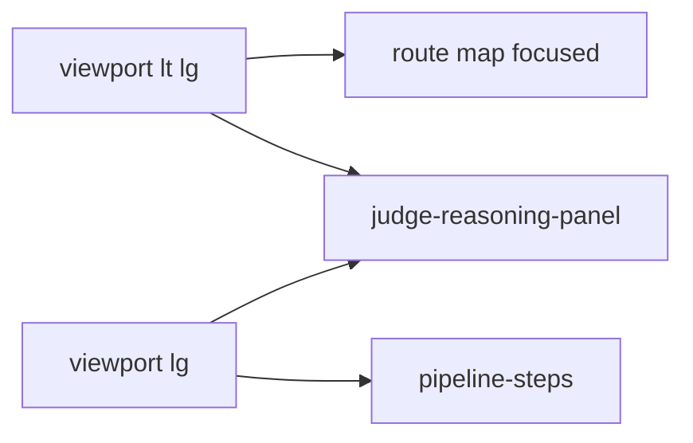
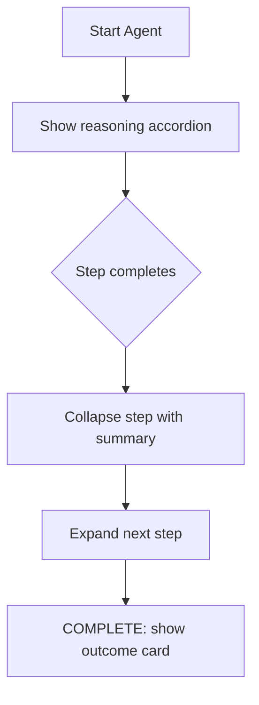

# Task: Mobile judge view — collapsible reasoning steps

## Goal
On mobile (and as a cleaner judge surface), show agent reasoning as GPT-style collapsible steps (what + why), not a long scroll of trace cards.

## Requirements
- Sticky "Agent reasoning" accordion with 5 pipeline steps
- Each step: collapsed = title + one-line `display_summary`; expanded = what, `why_brief`, optional detail
- Auto-expand active step; collapse completed steps
- Mobile: hide verbose coordinator/agent trace cards (`lg:` show full trace)
- Desktop: keep sidebar pipeline; also show reasoning accordion in main column
- Wire `STEP_SUMMARY` / `SUBAGENT_DONE` for all 5 agents including fleet-scout

## Flow (Mermaid)

### Sequence

### Per-route map

### End-to-end

## Acceptance Criteria
- [ ] Five collapsible steps update live from SSE
- [ ] Collapsed row shows what happened in one line
- [ ] Expanded row shows why_brief
- [ ] Mobile trace hides duplicate agent/coordinator cards
- [ ] Tap master header toggles all / current behavior like GPT

## Files to Change
- `webapp/index.html`
- `webapp/app.js`
- `webapp/styles.css`
