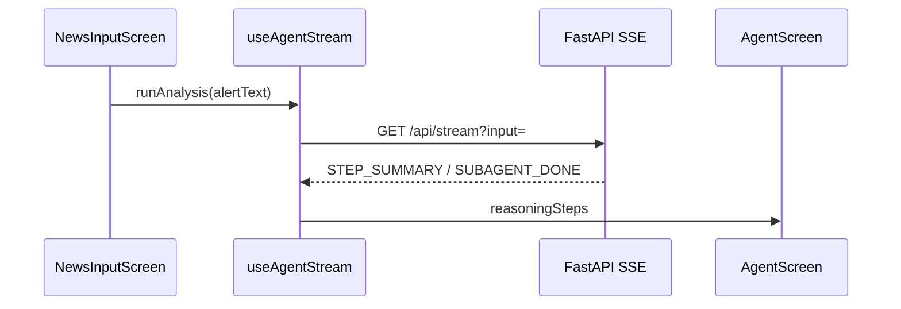
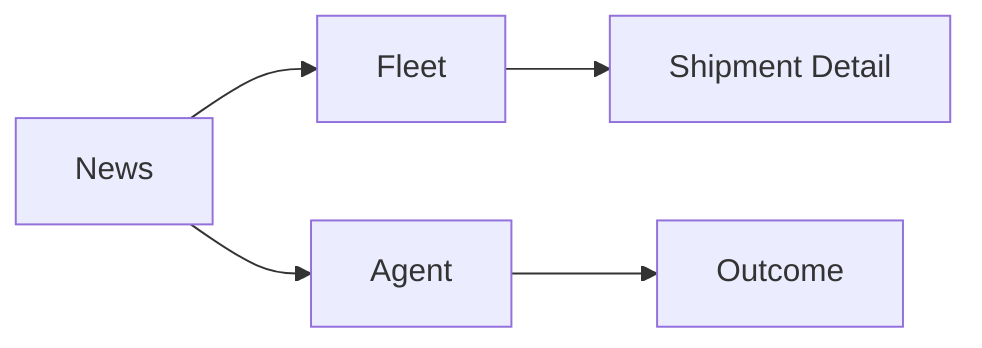

# Task: Mobile app integration — multi-screen, user-controlled input

## Goal
Refactor Expo app into focused screens: user picks news input, views fleet/routes, watches agent reasoning, sees outcome.

## Requirements
- **News** screen: scenario list + custom text + Run Agent (user chooses input)
- **Fleet** screen: shipments from `/api/baseline`, tap → detail with route + 4 alternatives
- **Agent** screen: GPT-style collapsible reasoning (5 steps), no terminal spam
- **Outcome** screen: before/after reroute from real CRM data
- Shared `api/` + `hooks/useAgentStream` for SSE (`GET /api/stream`)
- Tabs: News | Fleet | Agent | Outcome

## Flow (Mermaid)

### Sequence

### Screen map

## Acceptance Criteria
- [ ] User can select scenario or edit alert before run
- [ ] Fleet shows real Pakistani routes from API
- [ ] Agent shows 5 collapsible steps with what/why
- [ ] Outcome reflects CRM after reroute
- [ ] App.tsx is thin wiring only

## Files
- `mobile/src/api/*`, `mobile/src/hooks/*`, `mobile/src/types/*`
- `mobile/src/screens/NewsInputScreen.tsx`, `FleetScreen.tsx`, `ShipmentDetailScreen.tsx`, `AgentScreen.tsx`
- `mobile/App.tsx`, `mobile/src/components/BottomTabBar.tsx`
